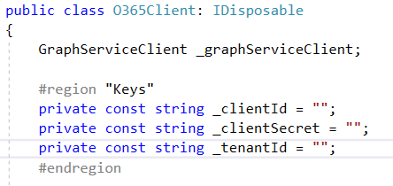
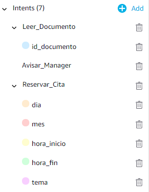

# sp-saturday-madrid-2019

Samples and materials from my session in SharePoint Saturday Madrid 2019 event.

## Alexa y SharePoint: Dando voz a nuestros documentos

### Configuración de la aplicación

Para que funcione la aplicación, deberemos informar del _clientId_ _clientSecret_ de la aplicación registrada en _AzureAD_ y _tenantId_ sobre el tenant que estamos trabajando.

### Configuración de la Skill

Deberemos crear una Skill en el [Alexa Developer Console](https://developer.amazon.com/alexa/console) con los siguientes _intents_:

